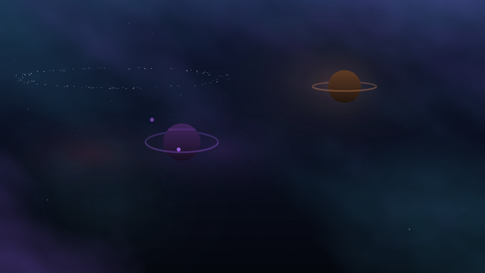

# Kumonari

A deep space theme for [Omarchy](https://omarchy.org), with a sky over the
wallpaper that turns, breathes and occasionally throws something across itself.



Four wallpapers, a cold palette, and an optional sky that is rolled fresh every
morning: one to three worlds with their own rings, moons and weather, two to
four clouds of gas, three depths of stars turning about a pole off the corner of
the screen, a comet every ten or twenty seconds, and now and then a distant
galaxy or a belt of rubble.

Nothing about it is a fixed picture. The layout comes from the calendar day, and
the colours come from whatever `colors.toml` the theme is wearing.

## Install

```sh
omarchy theme install https://github.com/sterre-g/omarchy-kumonari-theme
```

That is the whole theme: colours, wallpapers, icons, terminal, editors. It is
complete without anything moving, and if that is all you want you are done.

For the sky:

```sh
cd ~/.config/omarchy/themes/kumonari
./install.sh
```

## A different sky every day

The day is the seed. `Sky.js` rolls the whole scene from the local calendar
date, so the sky changes at midnight and stays put until the next one, and the
day you liked comes back if you set the clock back to it.

What the roll decides: how many worlds there are and where, how big, what colour,
whether they have rings and how flat those are seen, how many moons and how far
out, how much weather is on the disc, how many clouds of gas and where they sit,
how thick the stars are, and whether tonight gets a galaxy, a belt, or neither.

Two monitors get different skies on the same night. The seed is the day mixed
with the monitor's name, so both hold: one evening, two windows onto it.

`SystemClock` and not a `Timer` for the rollover. A Timer counts monotonic time,
which is the time the machine has been awake, so a laptop shut at eleven and
opened at nine would still be showing yesterday.

## Colours come from the theme

The sky reads the active theme's `colors.toml` and builds its palette out of it:
gas, planets, moons and stars are all hues the theme named. Edit `colors.toml`
and the whole sky follows. Nothing in the QML names a colour.

Hues are kept and brightness is not. A hue is what makes a palette
recognisable, so it is never touched; saturation and lightness are pulled into a
band a cloud can be seen in, because a theme whose palette sits at 15% saturation
would otherwise draw gas at 12% opacity over a dark wallpaper and show nothing
at all.

Three cases it has to survive, and does:

- a full palette (most themes name `red` through `magenta`): near-duplicate hues
  are dropped, since plenty of themes set `blue` and `accent` to the same value
  and two clouds of one colour reads as a mistake
- a sparse one (only `accent`, `foreground`, `background`): the rest are spun off
  the ones that are there, a fifth of the hue circle apart
- no `colors.toml` at all, which is not hypothetical: `aether` on this machine is
  an empty directory. The shell's own five colours are the floor

A theme with no colour in it keeps having none. Vantablack and an empty
directory both arrive as grey, and a grey spun round the hue circle would hand a
black-and-white desktop a green nebula it never asked for, so a colourless
palette is filled out in lightness instead.

Each day also starts at a different point in the palette, so a theme with seven
colours in it does not spend every night showing the same two.

## Looking at it without waiting a week

A wallpaper that changes every morning is awkward to check by looking at it. So
it renders offscreen:

```sh
bin/preview.sh                    # the next seven days, this theme's palette
bin/preview.sh --theme gruvbox    # the same seven in somebody else's
bin/preview.sh --days 30 --seed 7
```

No compositor, no theme switch, nothing on screen touched. `sky/Scene.qml` is
everything that draws and is plain Qt Quick, which is what makes this possible;
`sky/Sky.qml` next to it holds the Wayland half and draws nothing.

## The sky stops when the theme does

Animated backgrounds on Omarchy usually get this wrong, and it costs an
afternoon of confusion when they do.

An Omarchy shell plugin belongs to the desk, not to a theme. It is enabled once
and it draws until somebody turns it off, and switching theme never reaches it.
The usual way to put something animated on the desktop is to clone
`omarchy.background` and draw over the picture it was already drawing, which
makes two problems at once:

- the clone owns Omarchy's whole wallpaper implementation from then on, and has
  to keep up with it
- `omarchy.background` is switched off for **every** theme on the machine, so
  the animated one is still there after you have taken it off, recoloured to
  whatever you switched to

So this one adds instead of replacing. It draws on `WlrLayer.Bottom`, the layer
directly above the one wallpapers live on and directly below windows, which is
exactly the gap it belongs in. Omarchy goes on painting the picture and running
its own transitions for this theme and every other one. Nothing is disabled and
nothing needs putting back.

And it asks. Omarchy writes the theme's slug to
`~/.local/state/omarchy/current/theme.name` on its way through a change, before
it hands the shell the new colours, so the sky watches that file and draws only
when the answer is `kumonari`. Off means the layer surface is destroyed rather
than hidden, so a desktop wearing something else is not paying for this at all.

Switch away and you get that theme's wallpaper, which is the whole of what a
theme is.

## What it costs

Measured on a 2560x1600 screen with nothing else on the desktop:

| | omarchy-shell |
|---|---|
| Kumonari, sky drawing | 1.4% of a core |
| Any other theme | 0.3% of a core |
| Kumonari, a window over the desktop | 0.3% of a core |

Nothing here is animated in the usual sense. One timer steps a number five times
a second and every moving thing is a binding on it, because a running animation
in Qt Quick asks for a frame and a frame is the whole surface redrawn, at the
same cost whether the moon crossed the screen or moved a fifth of a pixel.
Written the obvious way this was 10% of a core. The rate is one number at the
top of `sky/Sky.qml` if you want it smoother.

The last row is the other half of it: `Hyprland.toplevels` says whether this
monitor is showing its desktop at all, and a single window over it stops the
clock. A sky nobody can see costs one idle timer.

## Removing it

```sh
cd ~/.config/omarchy/themes/kumonari && ./install.sh --remove
```

Or the whole theme, sky included:

```sh
omarchy theme remove kumonari
```

## Layout

```
colors.toml          the palette, and the only file the theme strictly needs
backgrounds/         the still pictures
bin/backgrounds.sh   which is where they come from
bin/preview.sh       render days offscreen, any theme, no compositor
sky/                 the shell plugin, id kumonari.sky
  Sky.js               all the arithmetic: palette, day, plan, star field
  Sky.qml              the Wayland half: layer surface, theme gate, clock
  Scene.qml            everything that actually draws
  Planet.qml           a world, built to whatever the day rolled
  Nebula.qml Glow.qml Starfield.qml Comet.qml Galaxy.qml Belt.qml
  preview.qml          Scene.qml, rendered to PNGs
test/                the arithmetic, under node
```

`sky/Sky.js` is where anything can go wrong: the colour parsing and lifting, the
day seed, the layout roll, and the star field. It runs under node as well as
QML, so `./run-tests` covers all of it without a compositor in the room. Worth
knowing about the two pieces that look arbitrary and are not: stars are spread
evenly over a disc rather than evenly along its radius, which is the difference
between a sky and a bullseye; and worlds are rolled with a separation check, so
two of them never touch.

```sh
./run-tests          the test suite, 31 cases
./dev-sync           the working tree into the installed plugin
./bin/preview.sh     look at the next week without waiting for it
./bin/backgrounds.sh rebuild the wallpapers from nothing but a seed
```

Adding a **new** file to an installed plugin needs `omarchy restart shell`. So
does editing one, if it is loaded as a `service`: the shell will say "Local
plugin changed, reloading" and go on running the code it started with. Editing
an existing file in a bar widget hot reloads.

## Credit

The wallpapers are generated by `bin/backgrounds.sh` and are not photographs of
anything. The theme-scoping approach came out of fixing the same problem in
[codincod-theme](https://github.com/reeveng/codincod-theme), which is where the
idea of a wallpaper that is actually running came from.

MIT.
